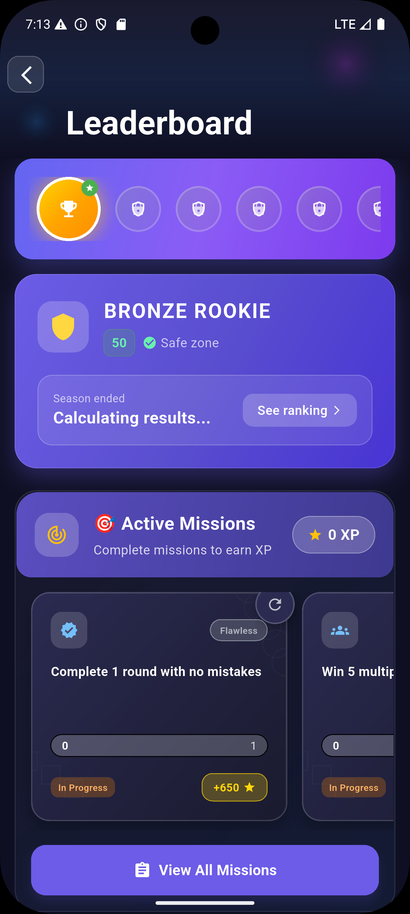
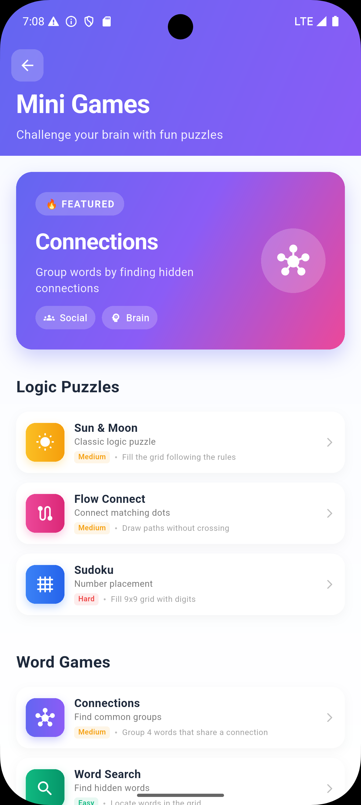

# Trivia Tycoon

[]()
[]()
[]()
[]()
[]()
[]()

Trivia Tycoon is a cross-platform trivia ecosystem built with Flutter. The app features a **tier-based ranking system**, **dynamic XP missions**, **a honeycomb skill tree**, **an offline-first architecture**, **QR code systems**, and **full administrative tools** for managing questions, analytics, encryption, and user behaviors.

This repository includes the entire player-facing and admin-facing Flutter application.

---

## 🖼️ Screenshots & Demo

> Add your real screenshots to `assets/screenshots/` and update paths below.

### 📱 Gameplay


### 🧠 Skill Tree (Honeycomb Layout)


### 🏆 Leaderboard (Tier System)


### 🛠 Admin Dashboard


### Mini Games


---

## 🎞️ Demo GIFs

> Add demo animations to `assets/demos/`.

- **Skill Tree Animation**  
  

- **QR Scanner**  
  

- **Mission Completion Animation**  
  

---

## ✨ Core Features

### 🧠 Gameplay & Player Progression
- Honeycomb-style skill tree (Knowledge, Power-ups, Strategy)
- Daily/weekly missions with XP, streaks, and bonuses
- Animated XP bar with glow and transitions
- Question categories, difficulty scaling, and media support

### 🏆 Ranking System
- Global + Tier-based ranking structure  
- 100 players per tier  
- Top 25 = promotion eligibility  
- Top 20 = daily rewards  
- Auto-scroll to player within tier

### 📊 Leaderboard & Player Profiles
- Streaks, engagement scores, activity tracking
- Country flag, rank badges, XP stats
- Profile QR sharing

### 📱 QR Ecosystem
- Custom QR generator (no external packages)
- Custom QR decoder engine
- Scan preview modal and full scan history
- Scan-type filters (profile, referral, mission, promo)

### 🛠 Admin Tools
- Question editor with tags, media, and encryption support  
- Question list with bulk delete, search, filtering  
- Encryption Manager (AES & Fernet)  
- Mission analytics dashboard  
- Scan analytics dashboard  
- Splash screen selector + animated previews  

---

## 🧰 Tech Stack

| Layer | Technology |
|------|------------|
| Framework | Flutter |
| Language | Dart |
| State Management | Riverpod |
| Offline Storage | Hive |
| Encryption | AES + Fernet |
| Router | GoRouter |
| Backend Integration | FastAPI or .NET microservices |
| QR | Fully custom painter & decoder engine |

---

## 🚀 Getting Started

### 1. Prerequisites
- Flutter SDK (matching version in `pubspec.yaml`)
- Xcode (macOS) and/or Android SDK
- Optional: API backend for online sync/auth

### 2. Clone Project
```bash
git clone https://github.com/devartblake/trivia_tycoon.git
cd trivia_tycoon
```

### 3. Install Dependencies
```bash
flutter pub get
```

### 4. Configure the App
Primary client config files in this repo:
- `assets/config/config.json` (runtime app config used by `ConfigService`)
- `.env.example` (example environment values)

Common values:
- `API_BASE_URL` (backend URL, e.g. `https://localhost:5000`)
- `API_WS_BASE_URL` (optional WS base, e.g. `ws://10.0.2.2:5000`; defaults to API base with ws/wss scheme)
- `API_MATCH_HUB_URL`, `API_PRESENCE_HUB_URL`, `API_NOTIFY_HUB_URL` (optional explicit WS endpoints)
- `ENABLE_LOGGING` (`false` by default to reduce client console noise)
- `USE_BACKEND_AUTH` (`true` to use `/auth/*` endpoints)

### Logging noise controls (client + backend)
If you see high-volume logs in local development, use the following defaults:

```bash
# Flutter/client-side verbose logging
ENABLE_LOGGING=false

# ASP.NET Core backend request lifecycle logs
Logging__LogLevel__Default=Warning
Logging__LogLevel__Microsoft.AspNetCore=Warning
```

This keeps warnings/errors visible while suppressing request-level informational lines such as:
- `Request starting ...`
- `Executing endpoint ...`
- `Request finished ...`

> Note: the `Logging__...` keys must be applied to your **backend service environment** (or backend `appsettings`), not just the Flutter app.

### 5. Run the App
```bash
flutter run
```

### 6. Performance Strategy (Flutter vs Flame)

You can use Flame in this project, but it should be scoped to mini-games or animation-heavy surfaces—not the whole app shell.

**Current architecture fit**
- The app is primarily a standard Flutter product app (forms, routing, profile/admin/settings screens) where Flutter widgets are the right default.
- The project already uses many `CustomPainter`/animation-heavy components, so the main wins usually come first from frame-budget and rebuild optimization.

**When Flame helps most**
- Real-time loops (60 FPS gameplay), sprite systems, collision systems, and camera/world transforms.
- Particle-heavy mini-games and deterministic game state updates.
- A contained game scene embedded in existing Flutter screens.

**When Flutter-only is usually better**
- CRUD/auth/profile/settings/menu flows.
- UI-first screens with moderate animation where you can optimize repaints and layout churn.

**Recommended hybrid approach**
1. Keep app shell/navigation/auth/settings in Flutter widgets.
2. Introduce Flame only for modules that need a fixed game loop (e.g., arcade/mini-games).
3. Bridge state through Riverpod adapters (Flutter side owns session/profile; Flame side consumes immutable snapshots/events).

**High-impact optimizations without Flame**
- Measure first in `--profile` and DevTools (CPU/GPU/frame timeline), then optimize bottlenecks.
- Reduce rebuild scope (`const` widgets, finer-grained providers/selectors, avoid broad `setState`).
- Bound paint cost (`RepaintBoundary` for expensive painters, cache static layers, ensure `shouldRepaint` is strict).
- Lower overdraw/compositing pressure (limit large transparent stacks and blur/shadow-heavy layers in animated screens).
- Precache heavy assets and decode images at display size.
- Move heavy parsing/transforms to isolates (`compute`) when they affect UI frames.

**If adopting Flame**
- Start with one isolated game feature behind a flag.
- Define clear handoff boundaries (enter game scene, emit result, return to Flutter route).
- Keep networking/auth outside the game loop where possible.
- Track frame time/p99 jank before vs after to validate value.

In short: yes, Flame is compatible, but best results usually come from a hybrid strategy plus profiling-led Flutter optimizations first.

